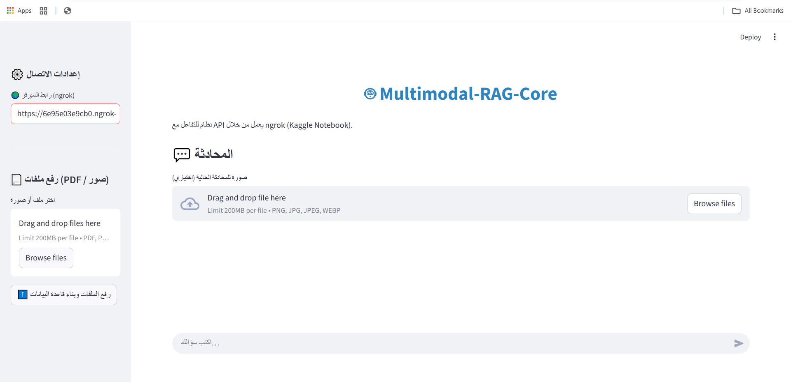
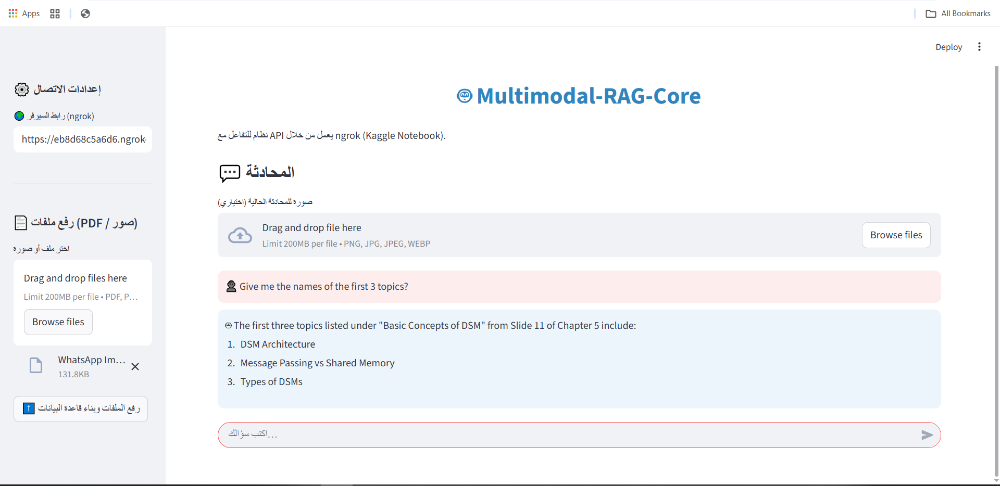
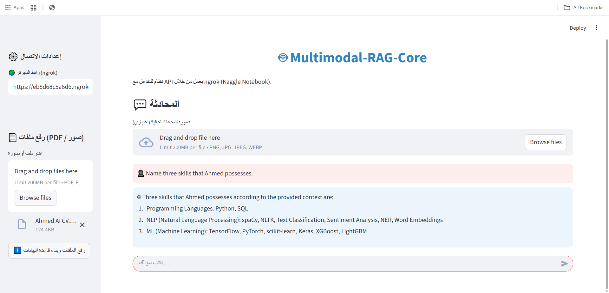

````markdown
# Multimodal RAG Core


A Multimodal RAG System powered by the **Qwen2.5-VL-7B-Instruct** model. This project enables seamless interaction and querying with unstructured data, including **PDFs, Images, and raw Text**, using a hybrid cloud-local architecture built with FastAPI and Streamlit.

---

## 🚀 Key Features

* **Multimodal Q&A:** Answer questions based on uploaded images (Vision-Language).
* **Document RAG:** Context-aware answers and summarization from PDFs and text files using LangChain and FAISS.
* **OCR Integration:** Extract text from images and documents to enhance retrieval accuracy.
* **Dual Architecture:** Decouples the GPU-intensive backend (Kaggle/Colab) from the lightweight frontend (Local Streamlit).
* **Dynamic Connectivity:** Uses **Ngrok** to establish a secure tunnel from the cloud backend to the local client.

## 📐 Project Architecture

This project employs a client-server architecture designed to leverage cloud GPUs while maintaining a local, interactive user experience:

| Component | Technology | Role | Location |
| :--- | :--- | :--- | :--- |
| **Backend** (Server) | FastAPI, Qwen-VL, PyTorch, FAISS | Handles file ingestion, RAG pipeline, LLM inference, and summarization. | **Cloud (Kaggle/Colab GPU)** |
| **Frontend** (Client) | Streamlit, Requests | Provides the interactive chat interface, file upload, and connects to the public Ngrok URL. | **Local Machine** |
| **Bridge** | Ngrok | Creates a publicly accessible HTTPS endpoint for the FastAPI server. | Cloud |
| **Core Model** | Qwen/Qwen2.5-VL-7B-Instruct | Vision-Language Model used for generation and multimodal understanding. | Cloud |

---

## 🛠️ Setup and Installation

### 1. Backend Setup (Kaggle Notebook or Colab)

The backend handles the model loading and runs the FastAPI server.

#### A. System Dependencies

Before installing Python packages, ensure the following system dependencies (required for PDF and OCR processing) are installed:

```bash
# Run this in your Kaggle/Colab Notebook environment:
!apt-get update && apt-get install -y tesseract-ocr poppler-utils
````

#### B. Python Dependencies

Install the necessary Python libraries for the backend logic:

```bash
cd backend
pip install -r requirements.txt
```

#### C. Configuration

Create a file named `.env` inside the `backend/` directory and add your Ngrok Authentication Token (required to expose the FastAPI server):

```dotenv
# .env file content
NGROK_TOKEN="YOUR_NGROK_AUTH_TOKEN_HERE"
```

#### D. Execution

Run the FastAPI application. This script will automatically connect to Ngrok and print the public URL.

```bash
python app.py
```

**IMPORTANT:** Note the generated public URL (e.g., `https://xxxx-xxxx-xxxx.ngrok-free.app`). You will need this for the frontend setup.

### 2\. Frontend Setup (Local Machine)

The frontend runs the lightweight Streamlit client.

#### A. Dependencies

Install the required packages locally:

```bash
cd frontend
pip install -r requirements.txt
```

#### B. Execution

Start the Streamlit application:

```bash
streamlit run app.py
```

Open the Streamlit URL in your browser, paste the Ngrok public URL obtained from the backend execution, and start interacting with your multimodal agent\!

-----

## 📸 Usage Screenshots

### 1. Main Interface
The clean Streamlit interface ready for multimodal interaction.


### 2. Image Understanding (Vision)
The model analyzing an uploaded image and answering questions about its content.


### 3. Document RAG
Extracting information from an uploaded PDF file using the RAG pipeline.


-----

## 🤝 Contribution

Feel free to open issues or submit pull requests. All feedback is welcome\!

## 📜 License

This project is licensed under the MIT License - see the LICENSE file for details.

```
```